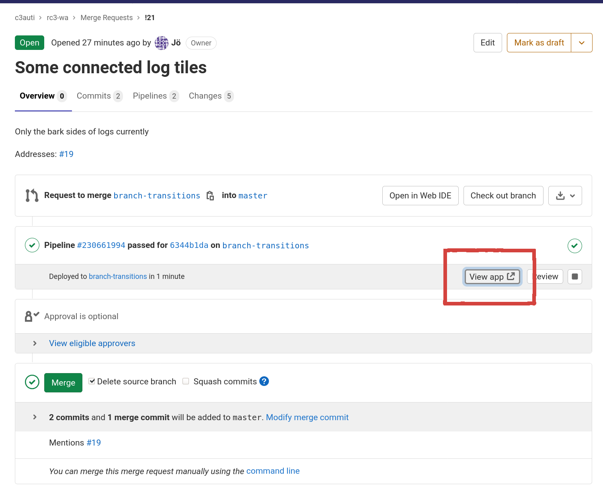

# c3auti Workadventure-Welt für den rC3

Konzept ist hier: [konzept/README.md](konzept/README.md)

There is also a Konzept for a visual style under
[art_direction/style_and_colors.svg](art_direction/style_and_colors.svg).

## Preview

Für master hier: https://wa.c3auti.jorrit.de/master/index.html

Merge Requests, die im haupt-Repo laufen haben eine Pipeline, die ebenfalls
den Content für eine Vorschau deployed.  Die Voransicht gibt es unter dem
"View app" Knopf unter der Pipeline des MR's.

