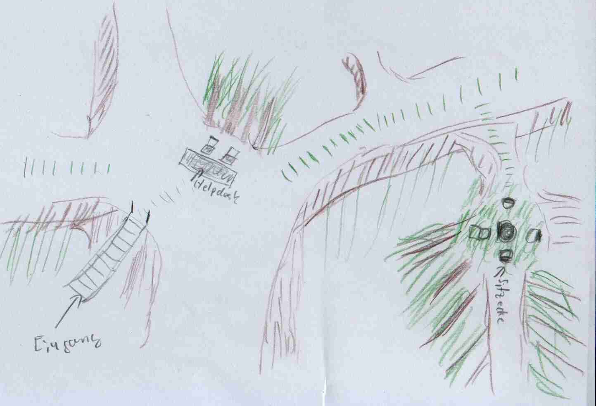
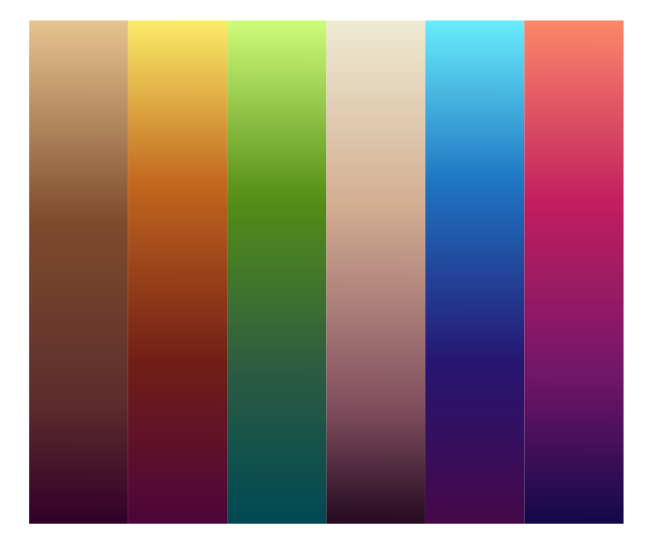

# Konzeption für den QuietQube in der rc3 world

## Features und Requirements
 - auti Helpdesk
 - Sitzecken
     - auch mit do not disturb Ecken
     - Spieleecke
 - Ruheraum
 - Kids-area
 - Kaminecke?
 - dedizierte ruhige Ecken in allen Räumen
 - kleine animationen zum drin verlieren
 - Konferenzraum für Veranstaltungen?
 - Auti Museum -> wenn wir Zeit dafür finden
 - Orga-Kämmerlein -> wenn wir Zeit dafür finden
 - "I need Support" Ecke
 - Tunnel zu CERT und Awareness?

## funktionelles Konzept
 - Ein holer Baumstamm mit reichlich platz im innern
 - Verschiedenen Ebenen, innerhalb und außerhalb des Baumstamms, verbunden duch eine
   Wendeltreppe (mit Abkürzung (Fahrstuhl?) zwischen Helpdesk und quiet-cube)
 - Jede Ebene realisiert duch eine eigene Map
 - Von oben nach unten:
   - Quiet Cube mit Kids Area und Spieleecke
   - Veranstaltungsraum
   - Helpdesk mit Portalen und "I need Support"-Ecke
   - Ruheraum (im Wurzelwerk)
 - Verteilung der Sitzecken auf Äste, um sie etwas vom Durchgansverkehr abzuschirmen (für das große ganze nehmen wir aber eher betalars' Konzept):
   

## visuelles Konzept

## Reccourcen
 - Tilesets
     - 16x16
       - DawnLike - 16x16 Universal Rogue-like tileset v1.81  
         https://opengameart.org/content/dawnlike-16x16-universal-rogue-like-tileset-v181  
         Umfangreiches Tileset mit hübschen Farben in 16x16 look  
         CC-BY-4.0
       - Lots of free 2d tiles and sprites by Hyptosis  
         https://www.newgrounds.com/art/view/hyptosis/tile-art-batch-1  
         CC-BY-3.0
       - https://opengameart.org/content/the-field-of-the-floating-islands
       - https://opengameart.org/content/dungeon-tileset
       - Cave tileset  
         https://opengameart.org/content/cave-tileset-0  
         CC-BY-3.0 GPL-2.0
       - https://opengameart.org/content/colony-sim-extended-version
     - 32x32
       - https://github.com/I-am-Erk/CDDA-Tilesets  
         CC-BY-SA-3.0
       - Tilemap template for Krita Tiled and Photoshop  
         https://github.com/GDQuest/krita-tileset-templates  
         CC-BY-4.0
       - RPG Nature Tileset - Seasons  
         https://stealthix.itch.io/rpg-nature-tileset  
         CC-0
       - 32x32 Basic Tileset Map  
         https://evan-fix.itch.io/32x32-basic-tileset  
         "You can use this freely without restrictions."
       - 32x32 (and 16x16) RPG Tiles--Forest and some Interior Tiles  
         https://opengameart.org/content/32x32-and-16x16-rpg-tiles-forest-and-some-interior-tiles  
         CC-BY-3.0
       - LPC: Modified base tiles  
         has some chairs+couches etc  
         https://opengameart.org/content/lpc-modified-base-tiles  
         CC-BY-3.0 CC-BY-SA-3.0 GPL-3.0
     - Nicht frei/verfügbar, aber gut für Inspiration
       - Time Fantasy: The Giant Tree
         https://finalbossblues.itch.io/giant-tree
         Nur noch Vorschaubilder zu sehen, aber geben eine Idee wie das
         tileset funktioniert
 - Farbschema  
   Erstellt von betalars
   
