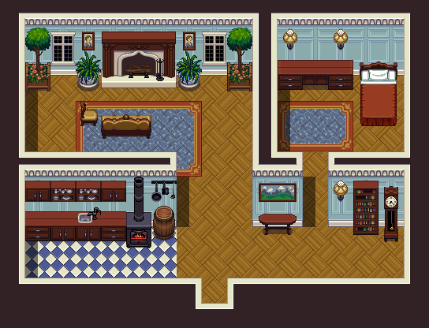
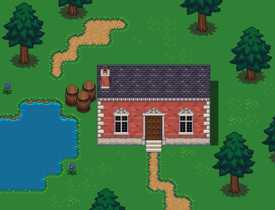

# LPC: Modified base tiles

https://opengameart.org/content/lpc-modified-base-tiles

# Notes

has some chairs+couches etc

# Preview

 

These are some of the tiles I've made in the LPC style modified to work in RPG
Maker VX Ace.  Among the updates is a fix to a few perspective errors I'd made
when I first drew the tiles so even if you don't use Ace this should have some
useful stuff.  Some of the tiles were commissioned by William Thompson who
would like to be aknowledged as a contributor.

# Copyright/Attribution Notice
Art or LPC or whatever you named this section of credits: Lanea Zimmerman
Extra Contributions or special thanks: William Thompson

# Licenses
[CC-BY 3.0](http://creativecommons.org/licenses/by/3.0/)
[CC-BY-SA 3.0](http://creativecommons.org/licenses/by-sa/3.0/)
[GPL 3.0](http://www.gnu.org/licenses/gpl-3.0.html)
[OGA-BY 3.0](http://opengameart.org/content/oga-by-30-faq)
